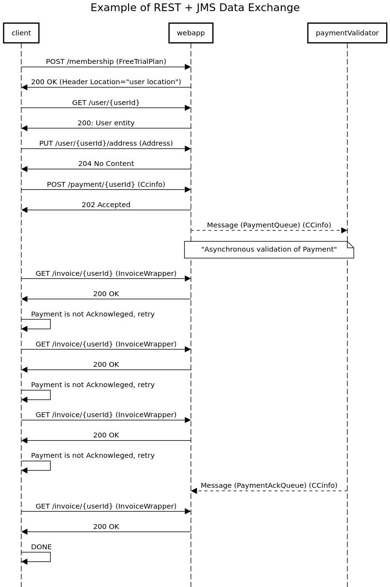

## What's here

this project contains all the moving parts to complete M1 MIAGE INF2 programming project. It contains configured CDI through Weld and Jersey's integration with HK2. In contains persistence with JPA, implemented with Eclipse Link on top of a H2 database. It shows how to design a REST API using JAXRS implemented by Jersey. All the JAXB Classes are generated by an XSD with the appropriate xjc bindings to make sure that we can handle Data smoothly.

## Running

### project-jee8

This is the parent projet

### project-jee8-model

This project containts sur JAXB generated DTO to be used for communication in the REST, JMS and Business Layer

### project-jee8-webapp

This project contains a REST API (JAXRS), the persistence layer (JPA), the service layer and make use of Messaging Queue (JMS) to calls to validate payments

### project-jee8-rest-client

This project shows how to call a REST API using Jersey Client for JAXRS

### project-jee8-jms-subscriber

This project consumes message produced by project-jee8-webapp to validate payment information

## external interfaces sequence diagrams

