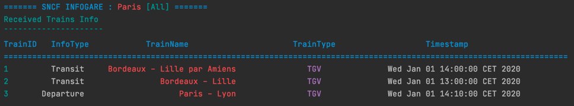
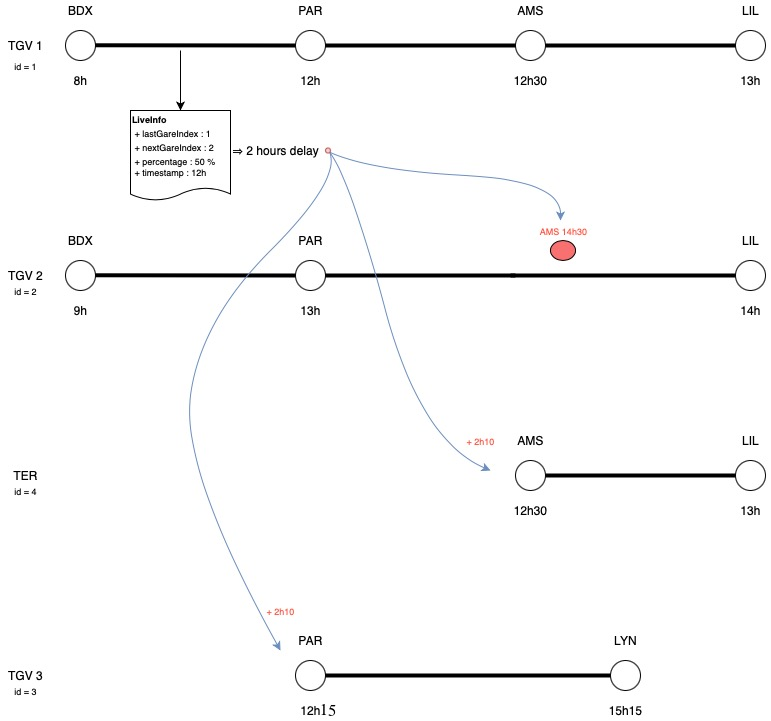
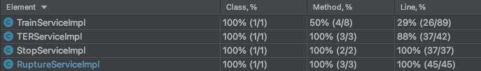
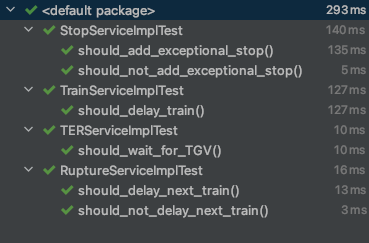

# What's here

This is our Programming Project as part of the INF2 Teaching Unit supervised 
by **[Nicolas Herbaut](mailto:Nicolas.Herbaut@univ-paris1.fr)** in Paris I Panthéon-Sorbonne University.  
It contains configured CDI through Weld and Jersey's integration with HK2.
It contains persistence with JPA, implemented with Eclipse Link on top of a H2 database.
It has a REST API using JAXRS implemented by Jersey.
All the JAXB Classes are generated by an XSD with the appropriate xjc bindings 
to make sure that we can handle Data smoothly.

---
# Project structure

The goal of the project is to model an application in order to respond to the problem of the Infocentre / Infogares
within the SNCF train company, we implemented business logic corresponding to given specifications, and made the components communicate as required.
This section details our conception choices.  
`project-jee8` is the parent project.

## The Model : `project-jee8-model`
  
  This project contains JAXB generated DTO to be used for communication in the REST, JMS and Business Layer. a.k.a. 
between the Trains and the Infocentre, and between the Infocentre and the Infogares.


DTOs :

- `LiveInfo` :
Is used by the train to transmit live information to the Infocenter.  
  Containing :
    - `lastGareIndex`: Sequential index of the last station traveled by the train.
    - `nextGareIndex`: Sequential index of the station where the train is going.
    - `percentage`: Percentage of distance traveled between stations `lastGareIndex` and `nextGareIndex`.
    - `timestamp` : Time and date the LiveInfo is sent.
    
    
- `InfoDTO` :
Is used by the Infocenter to transmit train informations to Infogares according to their JMS topic subscriptions. 
Containing :
    - `infoType` : Type of the information sent by the Infocenter (see `InfoTypeEnum`).
    - `trainId` : ID of the train concerned by the DTO.
    - `trainName` : Name of the train concerned by the DTO.
    - `trainType` : Type of the train concerned by the DTO.
    - `timestamp` : Time the train arrives at this station.
    - In case of disruption, the field `disruptionType` is also filled (see `EnumConditions`).
    
Enums :

- `InfoTypeEnum` :
Contains different types of `InfoDTO` (`Departure`, `Arrival`, `Transit`, `Disruption`), used to determine the
type of information received by the Infogare. The `All` field is used to tell the Infogare to display all
types of information.
  

- `EnumConditions` :
Contains different types of train delay reasons, used in a scenario where a train is delayed because of
certain circumstances.
  

## The Infocenter : `project-jee8-webapp`

  This project contains a REST API (JAXRS), the persistence layer (JPA), the service layer
  and makes use of Messaging Topics (JMS) to send information

### REST layer

  REST API made with Jersey (reference implementation of JAX-RS), contains two REST controllers :

- `TrainEndpoint` :
  This is the main endpoint of the application, the train must make a POST request to `/{id}/live` to send its
  `LiveInfo` (in request body) or to `/{id}/live` to send info with a delay cause.
  
- `DatabaseEndpoint` :
  Has no value in business logic, only used in this project to populate the database with test data by calling 
  `/db/populate` and to send first information to infogares by calling `/db/init`.
  

### Service layer

  Contains classes that handle business logic by performing the necessary calculations and dealing with the
  persistence layer. See JavaDoc for information about their methods.

- `TrainService` :
  First service called when receiving `LiveInfo`. Contains a method that calculates the delay based on the received
  information. Calls the other services according to the delay.


- `StopService` :
  Contains the implementation of :
  > Un train desservira exceptionnellement une gare si elle est sur son trajet et que le train
  > précédent a un retard de plus de 2h.
  

- `TERService` :
  Contains the implementation of :
  > Un TER pourra attendre un TGV, mais pas l’inverse.
  

- `RuptureService` :
  Contains the implementation of :
  > On ne retardera le train que si le nombre de passagers ayant réservés en rupture de
  > correspondance est > 50.

  See JavaDoc and code comments for more details.


- `InfogareSenderService` :
  Is responsible of sending the `InfoDTO` to the Infogares, uses the right JMS Publisher according to the `gareId` field.
  JMSPublishers are classes which handle the JAXB Marshalling of the DTO and send it to the topic injected in them.
  
### Persistence layer
  
  Use of JPA with an H2 in-memory database, and the DAO pattern as an interface to isolate the business and the 
  persistence layers.  
  Contains tables :

- `Trajet` : Describes a ride, with a name, type, lists of passengers and stations.
    - `parcoursId` : If two train have the same `parcoursId`, they have exactly the same route 
      but not necessarily the same service.
- `Passager` : Describes a passenger, used to determine any train connection breaks.
- `Correspondance` : Describes the reservation of a passenger for another train.  
  Notable fields :
    - `rupture` : Boolean used to mark a connection as broken. Helps in business rule 3.
- `DesserteTheorique` : Describes the scheduled service of the train. Used in business logic to compare with the current one.
- `DesserteReelle` : Describes the actual service of the train, after the delays and the decisions of the Infocenter.  
  Notable fields :
    - `seq` : The sequential number of the station, used in the `LiveInfo` DTO.
    - `desservi` : A boolean, tells if the station is served by the train.
- `Gare` : Describes a station.  
  Notable fields :
    - `code` : Used in JMS messaging to determine the topic associated to the station.
    
### JMS Messaging

  Use of the Publish-Subscribe mechanism with one topic per station, and injection with CDI,
  the suppliers provide the necessary instances to be injected.
    

## The Terminal (Infogare) : `project-jee8-jms-subscriber`

This project consumes `InfoDTO` produced by the Infocenter. Has a TrainSubscriber which is responsible of 
Unmarshalling the DTO, filtering and printing it as a formatted output.  
The JMSProducer provides the topic instance to be injected into the subscriber.  
The data is kept in a HashMap (`Map<Integer, InfoDTO>`) of key `trainId`, which ensures us that we have 
only one information about a given train at a time.  
Preview : (looks much better in IntelliJ <3)  
  


## The Train : `project-jee8-rest-client`

  This project is supposed to call Infogare REST API using Jersey Client for JAXRS.
  But we gave the teacher a Postman collection for him to test our project.


---
# Modeled scenario :
  
BDX = "Bordeaux Saint-Jean"; PAR = "Paris Montparnasse"; AMS = "Gare d'Amiens"; LIL = "Lille Flandres"; LYN = "Lyon Perrache".

---
# How to launch

  - `mvn clean install` in root
  - Run `Main.main()` in `project-jee8-webapp`
  - Run `InfoGareApp.main()` in `project-jee8-jms-subscriber` five times, each time by uncommenting 
    one topic injection in `jms/TrainSubscriber` (starting from line 27), you can also choose which information
    to display by changing the value of `infoGareType` in `TrainSubscriber`.
  - Import `files/postman.json` in Postman
  - Run requests in this order :
      - `1 - PopulateDB` to populate database with the modeled scenario data.
      - `2 - Init` to send first data to the Infogares, you can now check train states in the `jms-subscriber` consoles.
      - `3 - LiveInfo` to send live info, you can now check the changes in the Infogare screens.


---
# Useful SQL
  
These are a few SQL statements to paste in the H2 database to have a better visibility on what happens.  

- View the current route of a train (replace `TRAJET_ID` value)  
```sql
SELECT DESSERTEREELLE.*, NOM AS NOM_GARE, TYPE
FROM DESSERTEREELLE, GARE, TRAJET 
WHERE TRAJET_ID=1 
  AND DESSERTEREELLE.GARE_ID=GARE.ID
  AND DESSERTEREELLE.TRAJET_ID=TRAJET.ID
ORDER BY SEQ
```  

- View Correspondance states  
```sql
SELECT GARE.NOM AS NOM_GARE, PASSAGER_ID, PASSAGER.TRAJET_ID, RUPTURE, NEWDATE
FROM CORRESPONDANCE, TRAJET, PASSAGER, GARE
WHERE CORRESPONDANCE.TRAJET_ID=TRAJET.ID
  AND PASSAGER.CORRESPONDANCE_ID=CORRESPONDANCE.ID
  AND CORRESPONDANCE.GARE_ID=GARE.ID
```

---
# Code quality

Business logic code (Service Layer) is 80% Covered by unit tests.




# Contribution
- **[Massil TAGUEMOUT](mailto:massiltag@icloud.com)**
- **[Nelly UNG](mailto:nelly.ung18@gmail.com)**
- **[Nicolas LEWIN](mailto:ncalwn@gmail.com)**
- **[Sarah MEZIANE](mailto:sarahmez1999@gmail.com)**
- **[William DAI](mailto:williamdai19@gmail.com)**

M1 MIAGE APP  
Université Paris I Panthéon Sorbonne

Repository link : https://bitbucket.org/maxtag/sncf-infogare  